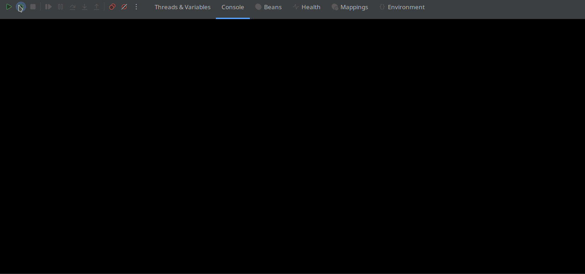

# MCP Host Project

## Description

This project showcases how to integrate Spring AI's support for MCP (Model Context Protocol) within Spring Boot applications, 
covering both server-side and client-side implementations.

## MCP
MCP is a standard that streamlines the management of contextual interactions in AI models, enabling consistent integration 
with external data sources and tools. 

[Spring AI MCP](https://docs.spring.io/spring-ai/reference/api/mcp/mcp-overview.html) extends the [MCP Java SDK](https://github.com/modelcontextprotocol/java-sdk) 
and provides dedicated Spring Boot starters for both clients and servers. 

The MCP client handles communication and connection management with MCP servers. 

In this project, we leverage Spring AI to build MCP servers, making their capabilities available to LLMs. 
Note that the use of a model supporting TOOLS is required; we are using `Llama3.2` via `Ollama`.

## Modules

This project consists of three main modules:

### Geocoder Service

- **Port**: 8081
- **Description**: Provides latitude and longitude for a given city.
- [configuration](geocoder/src/main/resources/application.yml)

```java
public interface Geocoder {
    GeoCodeResult geocode(String city) throws Exception;
}

public record GeoCodeResult(double latitude, double longitude) {}
```

### Timezone Service

- **Port**: 8082
- **Description**: Provides timezone information for a given latitude and longitude.
- [configuration](timezone/src/main/resources/application.yml)

```java
public interface TimeZoneService {
    Optional<TimeZone> getTimeZoneFromLocation(double latitude, double longitude) throws Exception;
}
public record TimeZone(
        String id,
        String name,
        int rawOffset,
        int dstSavings
) {}
```

### MCP Host

- **Description**: Uses the Geocoder and Timezone services via MCP clients and provides a console interface to interact with an LLM.
- [configuration](mcp-host/src/main/resources/application.yml)

```java
@Bean
CommandLineRunner runner(final ChatClient.Builder chatClientBuilder, List<ToolCallback> toolCallbacks) {

   final ChatClient agent = chatClientBuilder.build();

   return args -> {
      try (Scanner scanner = new Scanner(System.in)) {
         while (true) {
            System.out.print("\n\nEnter city (or type 'exit' to quit): ");
            String city = scanner.nextLine();
            if ("exit".equalsIgnoreCase(city)) {
               break;
            }

            String queryTemplate = """
                    Please use the available tools to find the latitude and longitude for the city `{city}`. Once you have this information, 
                    use the tools to determine and provide all the timezone details for that location in the same language.
                    """;

            String systemTemplate = """
                    You are an AI assistant specialized in providing geographical information. Your task is to use the provided tools to gather and deliver accurate data.
                    """;

            String llmResponse = agent
                    .prompt()
                    .advisors(new SimpleLoggerAdvisor())
                    .system(systemSpec -> systemSpec.text(systemTemplate))
                    .user(userSpec -> userSpec.text(queryTemplate).param("city", city))
                    .tools(toolCallbacks)
                    .call()
                    .content();

            log.info("\n\n{}", llmResponse);
         }
      }
   };
}
```

## Running the Project

1. **Start Geocoder Service**:
    ```bash
    cd geocoder
    mvn spring-boot:run
    ```

2. **Start Timezone Service**:
    ```bash
    cd timezone
    mvn spring-boot:run
    ```

3. **Start MCP Host**:
    ```bash
    cd mcp-host
    mvn spring-boot:run
    ```

## Usage

1. **Interact with MCP Host**:
    - Run the MCP Host application.
    - Enter city names in the console.
    - The system will provide latitude, longitude, and timezone information for the entered city.

Insertamos image

